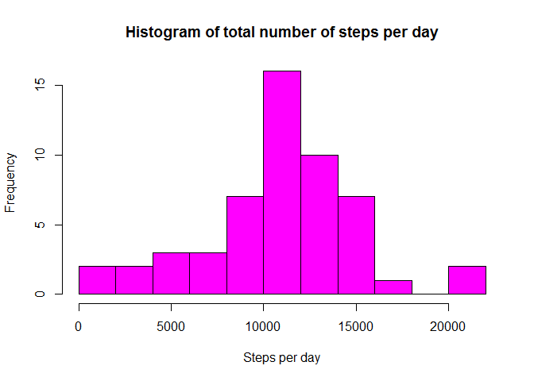
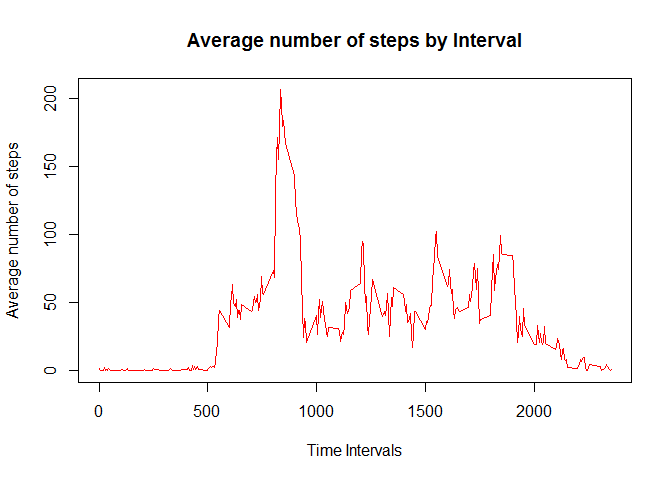
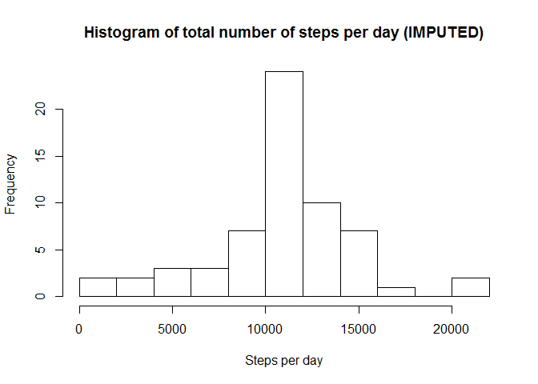
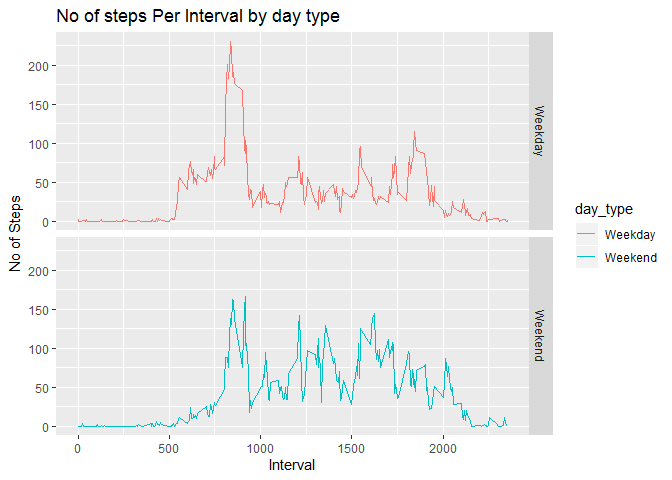

## What is mean total number of steps taken per day?
### Please note that while plotting all histograms, I have chosen to use, breaks = 15
### instead of the default value, I think default value for breaks is 5


```r
#set working directory
#setwd("datascience/Reproducible research/week2proj/RepData_PeerAssessment1")

#Loading the data 
#stepsdata<-read.csv("activity.csv")
if(!file.exists('activity.csv')){
    unzip('activity.zip')
}
stepsdata <- read.csv('activity.csv')
summary(stepsdata)
```

```
##      steps                date          interval     
##  Min.   :  0.00   2012-10-01:  288   Min.   :   0.0  
##  1st Qu.:  0.00   2012-10-02:  288   1st Qu.: 588.8  
##  Median :  0.00   2012-10-03:  288   Median :1177.5  
##  Mean   : 37.38   2012-10-04:  288   Mean   :1177.5  
##  3rd Qu.: 12.00   2012-10-05:  288   3rd Qu.:1766.2  
##  Max.   :806.00   2012-10-06:  288   Max.   :2355.0  
##  NA's   :2304     (Other)   :15840
```

```r
#Get complete cases 
stepsminNA <- stepsdata[complete.cases(stepsdata), ]

#Get steps per day 
steps_per_day <- aggregate(steps ~ date, stepsdata, sum)
#Plot Histogram
hist(steps_per_day$steps, breaks = 15,main = "Histogram of total number of steps per day", xlab = "Steps per day",col="magenta")
```

<!-- -->

```r
# mean of the total number of steps taken per day
mean(steps_per_day$steps)
```

```
## [1] 10766.19
```

```r
# median of the total number of steps taken per day
median(steps_per_day$steps)
```

```
## [1] 10765
```

## What is the average daily activity pattern?


```r
#Get complete cases 
stepsminNA <- stepsdata[complete.cases(stepsdata), ]

# average steps per interval for all days 
avgsteps_perinterval <- aggregate(steps ~ interval, stepsminNA, mean)

# Plot: Average number of steps by Interval
plot(avgsteps_perinterval$interval, avgsteps_perinterval$steps, type='l', col=2, main="Average number of steps by Interval", xlab="Time Intervals", ylab="Average number of steps")
```

<!-- -->

```r
# interval index which has the highest average steps
interval_index <- which.max(avgsteps_perinterval$steps)

# specific interval and the average steps for that interval
print (paste("The interval with the highest avg steps is ", avgsteps_perinterval[interval_index, ]$interval, " and the no of steps for that interval is ", round(avgsteps_perinterval[interval_index, ]$steps, digits = 1)))
```

```
## [1] "The interval with the highest avg steps is  835  and the no of steps for that interval is  206.2"
```

## Imputing missing values


```r
#Calculate and report the total number of missing values in the dataset (i.e. the total number of rows with NAs)
missing_values <- stepsdata[!complete.cases(stepsdata), ]
nrow(missing_values)
```

```
## [1] 2304
```

```r
# Locate the NA values in all rows
# Substitute the NA value with the avg steps for that interval

for (i in 1:nrow(stepsdata)) {
  if(is.na(stepsdata$steps[i])) {
    val <- avgsteps_perinterval$steps[which(avgsteps_perinterval$interval == stepsdata$interval[i])]
    stepsdata$steps[i] <- val 
  }
}

# Aggregate the steps per day with the imputed values
stepsperday_impute <- aggregate(steps ~ date, stepsdata, sum)

# Draw a histogram of the value 
hist(stepsperday_impute$steps, breaks = 15,main = "Histogram of total number of steps per day (IMPUTED)", xlab = "Steps per day")
```

<!-- -->

```r
mean(stepsperday_impute$steps)
```

```
## [1] 10766.19
```

```r
median(stepsperday_impute$steps)
```

```
## [1] 10766.19
```
## Are there differences in activity patterns between weekdays and weekends?


```r
#function to determine if the date is a weekday
week_day <- function(date_val) {
  wd <- weekdays(as.Date(date_val, '%Y-%m-%d'))
  if  (!(wd == 'Saturday' || wd == 'Sunday')) {
    x <- 'Weekday'
  } else {
    x <- 'Weekend'
  }
  x
}

# Apply the week_day function and add a new column to activity dataset
stepsdata$day_type <- as.factor(sapply(stepsdata$date, week_day))

#load the ggplot library
library(ggplot2)

# Create the aggregated data frame by intervals and day_type
stepsperday_impute <- aggregate(steps ~ interval+day_type, stepsdata, mean)

# Create the plot
plotn <- ggplot(stepsperday_impute, aes(interval, steps)) +
  geom_line(stat = "identity", aes(colour = day_type)) +
  theme_gray() +
  facet_grid(day_type ~ ., scales="fixed", space="fixed") +
  labs(x="Interval", y=expression("No of Steps")) +
  ggtitle("No of steps Per Interval by day type")
print(plotn)
```

<!-- -->

## Some differences in activities on weekdays and weekends like late start on weekends, however more steps later in the day on weekends.
